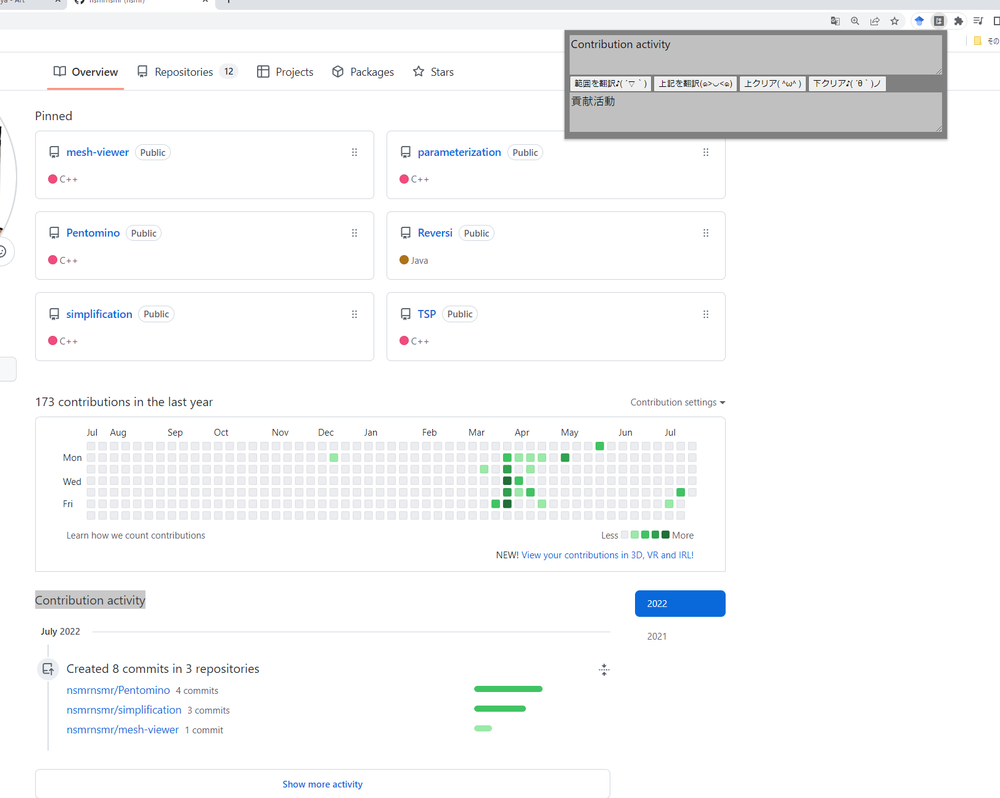

## ほんやくん
DeepL API を利用したChromeでDeepL翻訳が利用できる拡張機能です．DeepL翻訳でpdf内の文章をコピー＆ペーストしたときの変な改行を綺麗に揃えてから翻訳してくれます．
### フォルダ構成
```
.
├── content.js
├── image
│   └── ...
├── jquery-3.6.0.min.js
├── manifest.json
├── popup.css
├── popup.html
├── popup.js
└── readme.md
```
### 利用方法
1. DeepL翻訳に登録し，DeepLのAPIを利用可能な状態にする．
2. APIの認証キーをhonyakunフォルダ内`popup.js`の2行目API_KEYに貼り付け保存する．
```js
//popup.js

//Deepl API KEY
const API_KEY = 'ここに自身のDeepl APIのキーを入力';
```
3. Chromeを起動し，Chromeの設定 $\rightarrow$ その他のツール $\rightarrow$ 拡張機能 の順に移動しデベロッパーモードに切り替える．
4. 「パッケージ化されていない拡張機能を読み込む」からhonyakunフォルダを選択する．選択すると拡張機能の中にほんやくんが追加される．
5. 追加されると，右上の拡張機能アイコンが追加される．このアイコンを選択し，ほんやくん右の設定項目からほんやくんをピン止めする．
6. 翻訳したい英文を範囲選択し，右上のアイコンを選択する．ポップアップが表示され，その中の「範囲を翻訳」ボタンを押すことで翻訳することができる．

### 注意事項
pdfのページなど一部「範囲を翻訳」ボタンが上手く機能しない場合がある．この場合，翻訳したい英文をポップアップ内上のテキストボックスにコピー＆ペーストし，「上記を翻訳」ボタンを押すことで翻訳することが出来る．
